# ℹ️ Features

* Collection of highly versatile, general-use property drawers and decorators.
* All attributes work as-is without a custom inspector.
* 🤞 Reasonably lightweight.

<br/>

> 🧑‍💻💬 *These attributes are an aggregate of helper attributes I've made over the years for various projects. If I find myself wanting an attribute for multiple projects, it eventually ends up in here.*


<br/>

# 📦 Install

> Minimum Unity version: 2022.3

## 📦 Package Manager

1. Open Package Manager
2. Install package from Git URL:\
`https://github.com/Smidgens/unity-attributes.git#<tag_or_sha>`


<br/>


# 🚀 Overview

Attributes break down into four categories: Drawers, Decorators, Modifiers, and Standalone.

* Drawers modify how fields are displayed, and in some cases can be chained.
* Decorators add static elements above fields. Built-in examples include Unity's `[Header]` and `[Space]` attributes
* Modifiers supply additional options to drawers, such as custom labels, indents, or buttons. By themselves they do nothing.
* Standalone attributes are simple single-purpose property drawers that do not inherit from this project's base drawer.

## ⚡ Drawers

* [`DefaultDrawer`](#defaultdrawer)
* [`EditCondition`](#editcondition)
* [`Expand`](#expand)
* [`Inline`](#inline)
* [`Dropdown`](#dropdown)
* [`InstancedReference`](#instancedreference)
* [`Box`](#box)
* [`Foldout`](#foldout)
* [`Reorderable`](#reorderable)
* [`StableGUID`](#stableguid)
* [`GlobalObjectID`](#globalobjectid)
* [`ObjectMethodReference`](#objectmethodreference)
* [`SearchType`](#searchtype)
* [`SearchEnum`](#searchenum)
* [`NavMeshAgentID`](#navmeshagentid)
* [`NavMeshAreaID`](#navmeshareaid)
* [`ProjectLayer`](#projectlayer)
* [`ProjectSortLayer`](#projectsortlayer)
* [`ProjectTag`](#projecttag)
* [`ProjectScene`](#projectscene)
* [`ProjectPath`](#projectpath)
* [`BlendShape`](#blendshape)
* [`AnimatorParameter`](#animatorparameter)
* [`RendererMaterial`](#renderermaterial)
* [`HexColor`](#hexcolor)
* [`Slider`](#slider)
* [`IntervalSlider`](#intervalslider)
* [`Progress`](#progress)
* [`Switch`](#switch)
* [`Tabs`](#tabs)
* [`TextBox`](#textbox)

## 🔧 Modifiers

* [`FieldButton`](#fieldbutton)
* [`FieldOptions`](#fieldoptions)
* [`InlineWidth`](#inlinewidth)
* [`InlineHidden`](#inlinehidden)
* [`DisplayIcon`](#displayicon)

## ⚡ Decorators

* [`BoxHeader`](#boxheader)
* [`Alert`](#alert)
* [`Comment`](#comment)
* [`Link`](#link)
* [`Texture`](#texture)
* [`Divider`](#divider)
* [`StaticButton`](#staticbutton)

## ⚡ Standalone

* [`FieldLabel`](#fieldlabel)
* [`FieldIndent`](#fieldindent)

<br/>

# 🚀 Attributes


## ⚙️ Drawers


### `[DefaultDrawer]`

> Fields: `any`

Draws the default property drawer. This attribute exists to allow modifier attributes like buttons to work with regular drawers.

<br/>

### `[EditCondition]`

> Fields: `any`\
>🎚️ `expression`|`hide`

Toggles field hidden/read-only depending on supplied conditional expression.

```cs
[FieldOptions]
public bool hideToggle;

[EditCondition("hideToggle", hide:true)]
[FieldOptions(indent:1)]
public string hiddenOnToggle;

public int intValue;

public TestEnum enumValue;

// show on enum value
[EditCondition("enumValue == Value1")]
public string enableIfValue1;

// show using int field
[EditCondition("intValue > 10")]
public string enableIfInt;


enum TestEnum
{
	None = 0,
	Value1 ,
	Value2,
	Value3,
}
```
<br/>

### `[Expand]`

> Fields: `class`|`struct`\
>🎚️ `innerOnly`

Expands all child fields. Label can be optionally hidden.

```cs
[Serializable]
public struct ExpandableStruct
{
	public string name;
	public Texture2D icon;
}

// show child props indented
[Expand]
public ExpandableStruct expanded1;

// only show child props
[Expand(innerOnly:true)]
public ExpandableStruct expanded2;
```

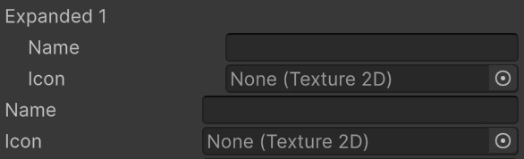

<br/>

### `[Inline]`

> Fields: `class`|`struct`

Inlines all child fields in a single row.

* `[InlineWidth]` can be used to specify the preferred size of specific fields.

* `[InlineHidden]` can be used to exclude fields from being inlined.

```cs
[Inline]
public Vector3 inlinedVector;

[InlineWidth("key", 30f)]
[Inline]
public InlinedType inlinedCustom;

[Serializable]
public struct InlinedType
{
	public string key;
	public string name;
	[InlineWidth(40f)]
	public int count;
	[InlineWidth(0.25f)]
	public Texture2D icon1;
	[InlineWidth(0.25f)]
	public Texture2D icon2;
}
```

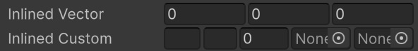

<br/>

### `[Dropdown]`

> Fields: `any`\
>🎚️ `optionFn`|`boxedValues`

Shows a dropdown list of values for field. Values can be supplied directly, or a reference to an options method can be used which returns an `IEnumerable` of `(string,<type>)` tuples (label/value).

Has special behaviour when placed on `UnityEngine.Object` fields where values can be supplied as folder paths or asset GUIDs.

```cs
[Dropdown("option1", "option2")]
public string stringValue;

[Dropdown(0.5f, 1.2f, 2.4f)]
public float floatValue;

[Dropdown(0, 10)]
public int intValue;

// load asset options
[Dropdown("Assets/Textures/icons/", "460278ced8f4db444b2b4cd02a08f984")]
public Texture2D icon;

// relative path to options
[Dropdown("GetColorOptions")]
public Color colorValue;

// absolute path to options
[Dropdown("GetColorOptions;MyType, MyModule")]
public Color colorValue2;

public static List<(string, Color)> GetColorOptions()
{
	return new ()
	{
		("White", Color.white),
		("Black", Color.black),
		("Clear", Color.clear),
		("Red", Color.red),
		("Blue", Color.blue),
		("Green", Color.green),
		("Yellow", Color.yellow),
		("Magenta", Color.magenta),
	};
}
```

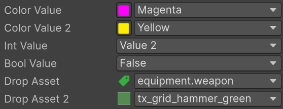

<br/>

### `[InstancedReference]`

> Fields: `class`

Draws a popup list of new-able types on field with [`[SerializeReference]`](https://docs.unity3d.com/6000.0/Documentation/ScriptReference/SerializeReference.html).

```cs
[InstancedReference]
[SerializeReference]
public BaseClass instance;

[Serializable]
abstract class BaseClass {}

[Serializable]
class ClassA : BaseClass
{
	public int myValueFromA;
}

[Serializable]
class ClassB : BaseClass
{
	public int myValueFromB;
}
```

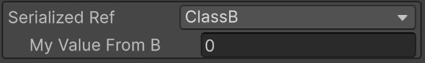

<br/>

### `[Box]`

> Fields: `any`

Wraps field in outlined box.

Tips:
* Combine with `[Expand(innerOnly:true)]`.

```cs
[Box]
[Expand(innerOnly:true)]
public GroupedFields fieldGroup;

[Serializable]
public struct GroupedFields
{
	public int count;
	public string name;
}
```

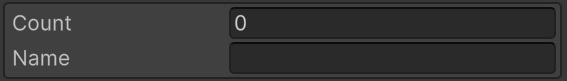

<br/>

### `[Foldout]`

> Fields: `any`\
>🎚️ `label`|`iconGUID`|`iconCoords`

Wraps field in foldout box.

Tips:
* Combine with `[Expand(innerOnly:true)]`.

```cs
[Foldout(iconGUID:"b4508e266a1d41445a0cb18bd9acf8d6")]
[Expand(innerOnly:true)]
public FoldableStruct foldedStruct;

[Serializable]
public struct FoldableStruct
{
	public int count;
	public string name;
}
```

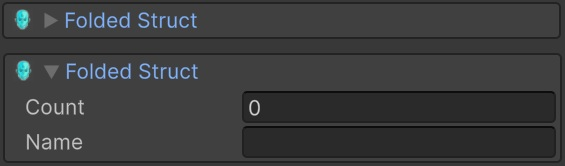

<br/>

### `[Reorderable]`

> Fields: `Array`|`List`\
>🎚️ `flags`|`fieldName`

Draws an array as a reorderable drag list with various customization options and helpers.

In Unity 6 and later the attribute can be placed directly on arrays.

For older versions, a wrapper type needs to be used.

**Unity 6+**:
```cs
// draws collapsed list of colliders
[Reorderable((EReorderable.Minimal|EReorderable.Foldable))]
public Collider[] foldableList;

// hide size input
[Reorderable(EReorderable.Minimal & ~EReorderable.Resizable)]
public string[] nonResizeable;

// draws standard-looking list
[Reorderable(EReorderable.Standard)]
public string[] standardList;
```

**Pre-Unity 6**
```cs
// wrapped array, requires reference to field
[Reorderable("array", EReorderable.Minimal|EReorderable.Foldable)]
public WrappedArray<Collider> wrappedList;

// array wrapper
[Serializable]
public struct WrappedArray<T>
{
	public T[] array;
}
```

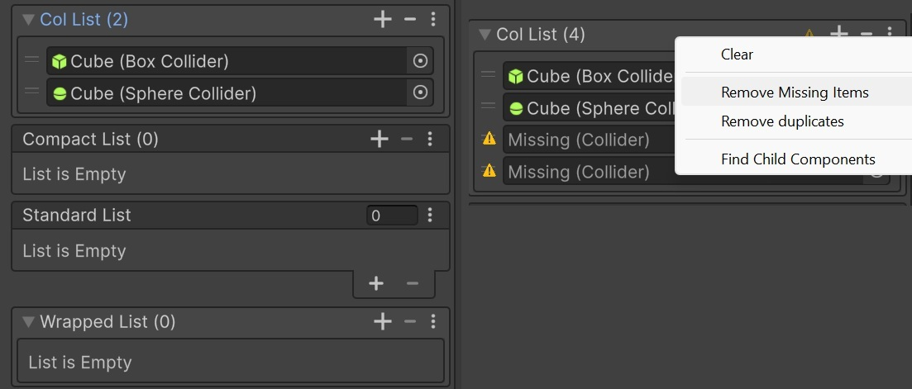

<br/>

### `[StableGUID]`

> Fields: `string`

Shows helper for generating stable GUID for the serialized object. Uses [GlobalObjectId](https://docs.unity3d.com/6000.0/Documentation/ScriptReference/GlobalObjectId.html) to verify uniqueness and warns about clashes. The GUID and the serialized object's global ID are concatenated and saved to string.
Can be leveraged to implement stable IDs for scene objects added at editor time.

```cs
[StableGUID]
public string guid;
```

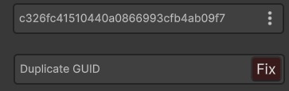

<br/>

### `[GlobalObjectID]`

> Fields: `string`

Simpler version of [`StableGUID`](#stableguid) that automatically sets the field value to the serialized object's [Global ID](https://docs.unity3d.com/6000.0/Documentation/ScriptReference/GlobalObjectId.html) 

```cs
[GlobalObjectID]
public string objectID;
```


<br/>


### `[ObjectMethodReference]`

> Fields: `string`\
>🎚️ `field`|`delegateType`|`delegateTypeFn`|`flags`

Shows a dropdown of instance methods available on referenced `UnityEngine.Object`. If the target object is either a `GameObject` or `Component`, the displayed options will include any Components on the referenced `GameObject`, same as `UnityEvent`.

The method referenced is stringified on the following form:

```
<name>;<return_type>;<arg_type1>|<arg_type2>...;<target_type>`
```
**Example**:
```
set_name;System.Void,mscorlib;System.String,mscorlib;UnityEngine.Transform,UnityEngine.CoreModule
```

**Notes**:

* Properties are referenced via their backing methods whose names are prefixed with `get_`/`set_`.
* Types referenced use assembly qualified names.
* To allow generic delegates to be supplied to attribute, the `delegateTypeFn` option can be used.

```cs
public GameObject objectField;
	
[ObjectMethodReference("objectField", typeof(Action<string>))]
public string method;

// use type getter if we're in templated type
[ObjectMethodReference("objectField", "GetDelegateType"))]
public string method;

// return the type of our generic delegate
Type GetDelegateType()
{
	return typeof(Action<T>);
}
```

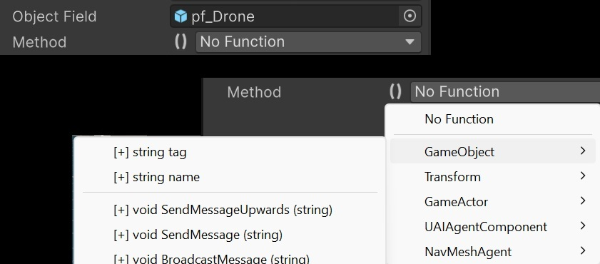

<br/>


### `[SearchType]`

> Fields: `string`\
>🎚️ `flags`|`baseType`|`assemblies`|`namespaces`

Provides a searchable popup for assembly types with various filtering options.

```cs
[SearchType]
public string anyType;

// only show component types
[SearchType(baseType: typeof(Component))]
public string componentType;

// only show system module types
[SearchType(assemblies: new string[]{ "mscorlib" })]
public string systemType;
```


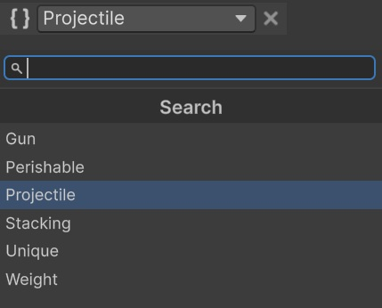

<br/>

### `[SearchEnum]`

> Fields: `enum`

Shows a searchable popup of values in enum.

```cs
[SearchEnum]
public KeyCode someKey;
```

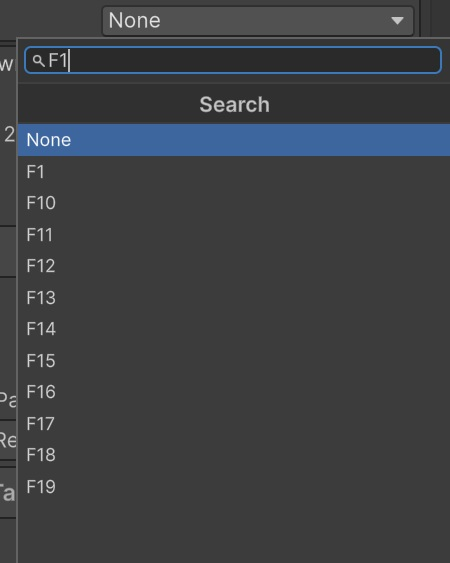

<br/>

### `[NavMeshAgentID]`

> Fields: `int`

Draws popup of NavMesh agent types in project.

```cs
[NavMeshAgentID]
public int agentID;
```

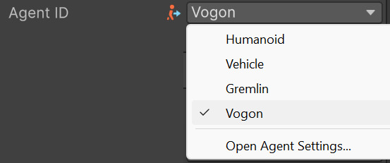

<br/>

### `[NavMeshAreaID]`

> Fields: `int`

Draws popup of NavMesh area types in project.

```cs
[NavMeshAreaID]
public int areaID;
```

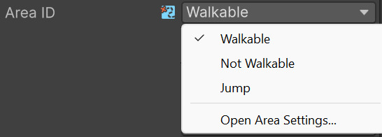

<br/>

### `[ProjectLayer]`

> Fields: `int`

Dropdown of project layer indices.

```cs
[ProjectLayer]
public int layerIndex;
```

<br/>

### `[ProjectSortLayer]`

> Fields: `int`

Dropdown of project sorting layer indices.

```cs
[ProjectSortLayer]
public int sortLayer;
```

<br/>

### `[ProjectTag]`

> Fields: `string`

Dropdown of project tags.

```cs
[ProjectTag]
public string pTag;
```

<br/>

### `[ProjectScene]`

> Fields: `int`|`string`\
>🎚️ `buildOnly`

Shows dropdown of scenes in project and saves value as scene path or index in build settings.


```cs
[ProjectScene]
public string scenePath;

[ProjectScene(buildOnly:true)]
public int sceneIndex;
```

<br/>

### `[ProjectPath]`

> Fields: `string`\
>🎚️ `mode`|`pattern`

Draws popup of paths relative to project root directory. Can be set to either folder or file paths.

```cs
// show blender files
[ProjectPath(pattern:"*.blend")]
public string filePath;

// show folder paths
[ProjectPath(EProjectPath.Folder)]
public string folderPath;
```

<br/>

### `[BlendShape]`

> Fields: `int`|`string`

Shows dropdown of blend shapes in referenced skinned mesh renderer. Saves value as either string (shape name) or int (index in renderer array).


```cs
public SkinnedMeshRenderer myRenderer;

[AnimatorParameter("myRenderer")]
public string blendShapeName

[AnimatorParameter("myRenderer")]
public int blendShapeIndex
```

<br/>

### `[AnimatorParameter]`

> Fields: `int`|`string`\
>🎚️ `field`|`types`

Shows dropdown of parameters in referenced animator. Saves value as either string (param name) or int (param index).

```cs
public Animator animator;

[AnimatorParameter("animator")]
public string paramName;

[AnimatorParameter("animator")]
public int paramIndex;

// restrict to float or int params
[AnimatorParameter("animator", EAnimatorParameter.Float|EAnimatorParameter.Int)]
public string floatParam;
```

<br/>

### `[RendererMaterial]`

> Fields: `int`\
>🎚️ `field`

Shows dropdown of materials in referenced renderer. Saves value as int index to material in renderer material array.

```cs
public Renderer myRenderer;

[RendererMaterial("myRenderer")]
public int materialIndex
```

<br/>

### `[HexColor]`

> Fields: `string`\
>🎚️ `showAlpha`|`hdr`

Draws color picker for string field and saves as hex color value.

```cs
[HexColor]
public string hexColor = "#f00";
```

<br/>

### `[Slider]`

> Fields: `numeric`\
>🎚️ `min`|`max`|`step`|`precision`

Identical to `[Range]` attribute, but provides options for step and precision.

```cs
[Slider(1f,10f,1)]
public float sliderPrecision;

[Slider(1f,10f,0.5f)]
public float sliderStep;

[Slider(1,10)]
public int sliderInt;
```

<br/>

### `[IntervalSlider]`

> Fields: `class`|`struct`\
🎚️ `min`|`max`|`fMin`|`fMax`|`step`

Draws Min/Max slider and saves values to two separate child fields.

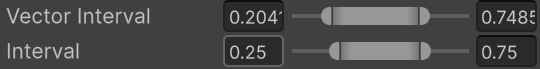

```cs
// default saves to x/y
[IntervalSlider(0f, 1f)]
public Vector2 vectorInterval;

// custom min/max fields
[IntervalSlider(0f, 1f, fMin:"min", fMax:"max", step:0.25f)]
public MyInterval interval; 

[Serializable]
public struct MyInterval
{
	public float min,max;
}
```

<br/>

### `[Progress]`

> Fields: `numeric`\
>🎚️ `min`|`max`|`label`

Draws numeric field as a progress bar.

```cs
[Progress(0, 100)]
public float health = 50;

[Progress(0, 100, "Status")]
public float health = 50;
```

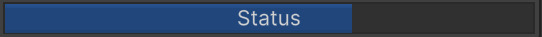

<br/>

### `[Switch]`

> Fields: `enum`|`flags`|`bool`|`LayerMask`\
>🎚️ `offLabel`|`onLabel`

Draws a toggle switch.

For flag and layermask fields, a switch will be drawn for every value.

```cs
[Switch]
public bool switch;

[Switch("Off", "On")]
public bool switchLabeled;

[FieldOptions(label:null)]
[Foldout,Switch]
public LayerMask switchLayers;

[FieldOptions(label:null)]
[Foldout,Switch]
public EnumFlags switchFlags;

[Flags]
enum EnumFlags
{
	Item1 = 1,
	Item2 = 2,
	Item3 = 4,
}
```

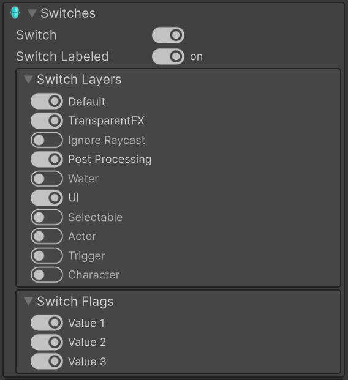

<br/>

### `[Tabs]`

> Fields: `enum`|`flags`|`bool`\
>🎚️ `vertical`

Draws a toolbar of buttons.

```cs
[Flags]
enum Options
{
	Value1 = 1,
	Value2 = 2,
	Value3 = 4,
}

[Tabs]
public Options flagTabs;

[Tabs]
public bool boolTabs;

[Tabs(vertical:true)]
public Options verticalTabs;
```

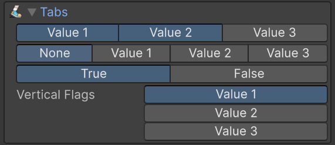

<br/>

### `[TextBox]`

> Fields: `string`\
>🎚️ `minLines`

Draws text area that resizes automatically.

```cs
[TextBox(minLines:3)]
public string textArea;
```

<br/>

<!--==============================================-->
<!--=================MODIFIERS====================-->
<!--==============================================-->


## 🔧 Modifiers

Modifiers work in conjunction with property drawers in that they modify their drawing in some way.

<small>⚠️ Modifiers only work if at least one attribute from this project is present. `[DefaultDrawer]` can be used to get them to work with regular drawers.</small>


<br/>

### `[FieldButton]`
> Targets: `field`\
> 🎚️ `width`|`label`|`flags`

Draws a button above field. Can reference method on field object, its owner, or any static method.

* Static methods can be referenced with the form `<name>;<assembly_type>`.
* Method on field itself can be referenced by prefixing the supplied name with `.` .
* Note: Methods cannot change values of struct types as their current contents get copied when invoking the function.

```cs
[FieldButton("OwnerMethod", width:0.5f)] 
[FieldButton(".SetMyValue", label:"Set=100",  args:new object[]{ 100 }, flags:EFieldUsable.Play, width:0.5f)] // inner
[FieldButton("LogValue;StaticClass, MyModule", args:new object[]{ 42 }, width:1f)]
[DefaultDrawer]
public OwnerOfFunctions fieldWithButtons;

private void OwnerMethod()
{
	Debug.Log("Outer method called!");
}

[Serializable]
public class OwnerOfFunctions
{
	public int myValue = 10;

	public void SetMyValue(int v)
	{
		myValue = v;
	}
}

class StaticClass
{
	public static void LogValue(int v)
	{
		Debug.Log(v);
	}
}
```


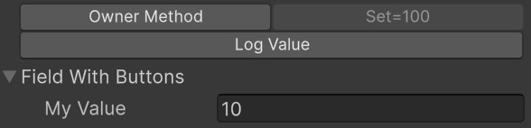

<br/>

### `[FieldOptions]`

> Targets: `field`\
> 🎚️ `label`|`useFlags`|`indent`

Allows overrides to be specified for given field.


```cs
// custom label
[FieldOptions(label:"Bojack")]
[DefaultDrawer]
public float nameYouWontSee;

// indented
[FieldOptions(indent:1)]
[DefaultDrawer]
public float horseman;

// hidden label
[FieldOptions(label:null)]
[DefaultDrawer]
public float unlabeledValue;

// use flags
[FieldOptions(useFLags:EFieldUsable.Play)]
[DefaultDrawer]
public float editableInPlayMode;
```

<br/>

### `[InlineWidth]`

> Targets: `field`\
> 🎚️ `field`|`width`

Supplies desired field width to `[Inline]` attribute. Can be placed on inlined field with name of child field, or on child field itself.

```cs
[InlineWidth("count", 40f)] // specific inner field
[Inline]
public InlineType inlined;

[Serializable]
struct InlineType
{
	public int count;
	public string text;
	[InlineWidth(40f)]
	public bool check;
}
```

<br/>

### `[InlineHidden]`

> Targets: `field`

Marks specific field to be excluded from being inlined, effectively hiding it when `[Inline]` is used.

```cs
[Inline]
public InlineType inlined;

[Serializable]
struct InlineType
{
	public int count;
	public string text;
	[InlineHidden]
	public bool hideMe;
}
```

<br/>

### `[DisplayIcon]`

> Targets: `class`|`struct`\
> 🎚️ `iconGUID`|`x`|`y`|`w`|`h`

Declares display icon to be shown for type in drawers. Used for example by [`InstancedReference`](#instancedreference).


<br/>

<!--==============================================-->
<!--=================DECORATORS===================-->
<!--==============================================-->

## ⚡ Decorators

Decorators are simple static elements drawn above fields.

<br/>

### `[BoxHeader]`

Draws large label inside outlined box above field.

```cs
[BoxHeader("My Section")]
public string documentedField1;

[BoxHeader("My Other Section", alignment:TextAnchor.MiddleCenter, style:FontStyle.Normal)]
public string documentedField2;
```

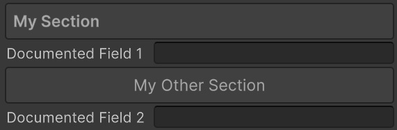

<br/>

### `[Comment]`

Draws comment paragraph above field.

```cs
[Comment("Something informative")]
public string documentedField;
```

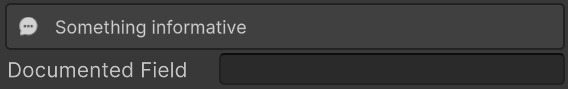

<br/>

### `[Alert]`

Draws tinted alert with icon over field.

<small>(Uses [CSS Bootstrap](https://getbootstrap.com/docs/4.0/utilities/colors/)-inspired colors.)</small>

```cs
[Alert("I'm important!", EAlert.Error)]
[Alert("I'm mildly important.", EAlert.Warning)]
[Alert("I'm noteworthy.", EAlert.Info)]
public string documentedValue;
```

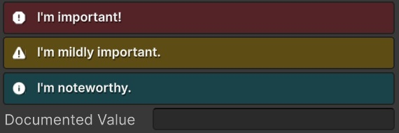

<br/>

### `[Link]`

>🎚️ `url`|`text`

Draws link to external site above field.

```cs
[Link("https://www.reddit.com/r/lotrmemes/", "Serious Documentation")]
public string documentedField;
```

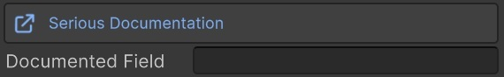

<br/>

### `[Texture]`

>🎚️ `guid`

Draws image texture above field.

```cs
[Texture("3ccb9ff0b1390bf4e99bf4e25bb72ddc")]
public string documentedField;
```

<br/>

### `[Divider]`

>🎚️ `marginTop`|`marginBottom`|`color`

Draws horizontal divider above field.


```cs
public string text;

[Divider]
public bool check;
```

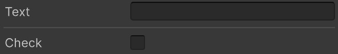

<br/>


### `[StaticButton]`

>🎚️ `method`|`label`|`args`

Draws button above field.

`[StaticButton]` works almost exactly as [`[FieldButton]`](#fieldbutton) with some limitations. Because it's a decorator, which has no knowledge of the field it's placed on, the method reference must be an absolute path to its type

```cs
[StaticButton("SayHi;StaticGreets, MyModule")]
[StaticButton("LogValue;StaticGreets, MyModule", label: "Log", args: new object[]{ 10 })]
public string buttonedField;

class StaticGreets
{
	public static void SayHi()
	{
		Debug.Log("Hello, wurst!");
	}

	public static void LogValue(int v)
	{
		Debug.Log("Your value is: " + v);
	}
}
```

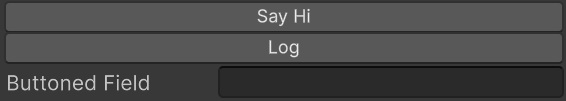

<br/>

<!--==============================================-->
<!--=================STANDALONE===================-->
<!--==============================================-->


## ⚡ Standalone

### `[FieldLabel]`

> Fields: `any`\
>🎚️ `label`


Overrides default label for field. Supplying `null` will hide it.

```cs
[FieldLabel("Custom Label")]
public string someField;

// hide label
[FieldLabel(null)]
public string fullWidthField;
```

<br/>

### `[FieldIndent]`

> Fields: `any`\
>🎚️ `indent`

Adds extra indent to field.

```cs
[FieldIndent(1)]
public string indentedField;
```